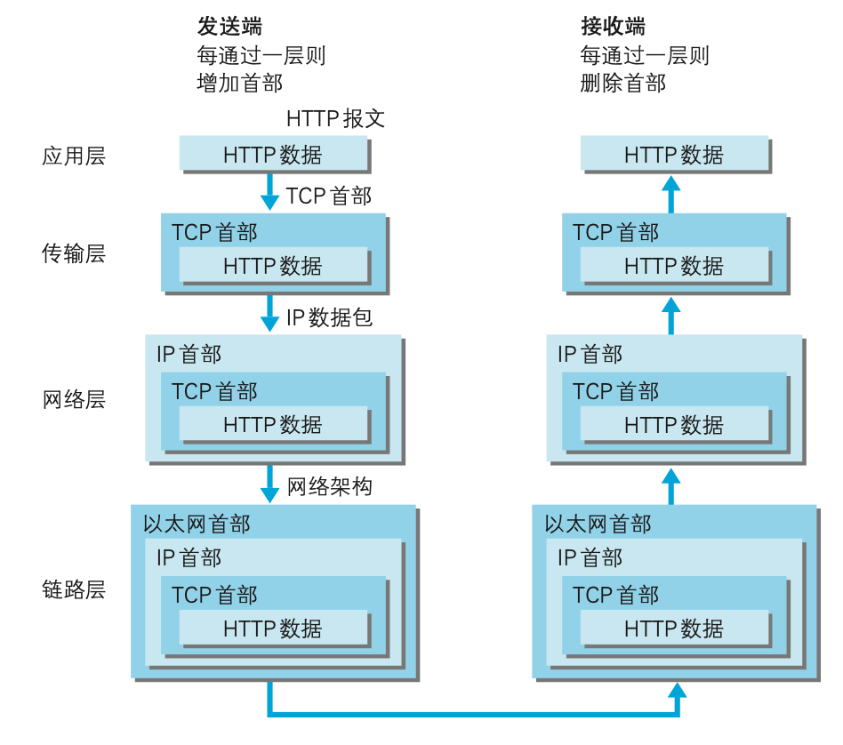

# Http协议

## 1. TCP/IP协议簇

TCP/IP分层管理：

* 应用层、传输层、网络层、数据链路层
* 层次化管理，分工明确可替换

### 1.1 应用层

决定了向用户提供应用服务时通信的活动，比如：FTP(File Transfer Protocol, 文件传输协议)、DNS(Domain Name System, 域名系统)、HTTP协议。

### 1.2 传输层

对上层应用层，提供处于网络连接中的两台计算机之间的数据传输，包含两个协议：TCP(Transmission Control Protocol, 传输控制协议)和UDP(User Data Protocol, 用户数据报协议)。

### 1.3 网络层（网络互连层）

处理在网络上流动的数据包（数据包是网络传输的最小数据单位），同时负责传输路线，在众多的选项中选择一条传输路线。

### 1.4 数据链路层（网络接口层）

处理连接网络的硬件部分，包括控制操作系统、硬件的设备驱动，NIC(Network Interface Card, 网络适配器，即网卡)，及光纤等物理可见部分（还包括链接器等一切传输媒介），硬件上的范畴均在链路层的作用范围之内。

### 1.3. TCP/IP 通信传输流

举例：

1. 发送端的客户端在应用层发出Http请求
2. 在传输层（TCP）协议把从应用层收到的数据（HTTP报文）进行分割，并在各个报文上打上标记序号及端口号后转发给网络层
3. 在网络层（IP协议），增加作为通信目的地的MAC地址后转发给链路层

发送端在层与层之间传输数据时，每经过一层会被打上一个该层所属的首部信息，反之，接收层在层与层传输数据时，每经过一层时会把对应的首部消去

### 1.4 IP、TCP、DNS

#### 负责传输的IP协议
IP(Internet protocol， 网际协议)属于网络层，负责把各种数据包传输给对方，依赖IP地址和MAC地址（Media Access Control Address）.

* IP地址指明了节点被分配到的地址（可变换）
* MAC地址是指网卡所属的固定地址（基本上不会更改）

IP地址可以和MAC地址进行配对。
ARP(Address Resolution Protocol)是一种用以解析地址的协议，根据通信方的IP地址就可以反查出对应的MAC地址。

为了把数据传输给对方，需要经过很多计算机和网络设备中转才能连接到对方，这个过程叫路由选择，类似于快递公司的送货过程。
**无论哪台计算机、哪台网络设备，都无法全面掌握互联网中的细节**

#### 确保可靠性的TCP协议
TCP位于传输层，提供可靠的字节流服务。

* 字节流服务：为了方便传输，讲大块数据分割成以报文段为单位的数据包进行管理

总之，TCP协议为了更容易传送大数据会把数据分割，而且能够确认数据最终是否送达到对方。
##### 确保数据到达目标

 **三次握手**

如果中途莫名中断，会再次以相同的顺序发送相同的数据包

#### 负责域名解析的DNS服务
DNS位于应用层，通过域名到IP地址之间的解析服务

#### 各种协议与HTTP协议的关系

