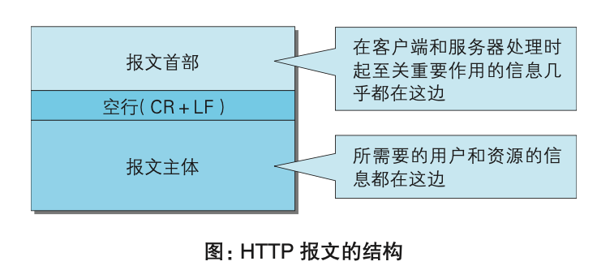
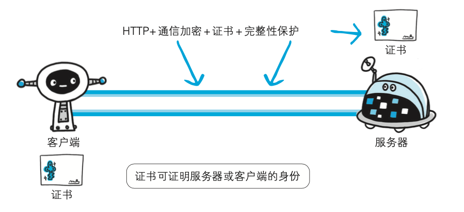
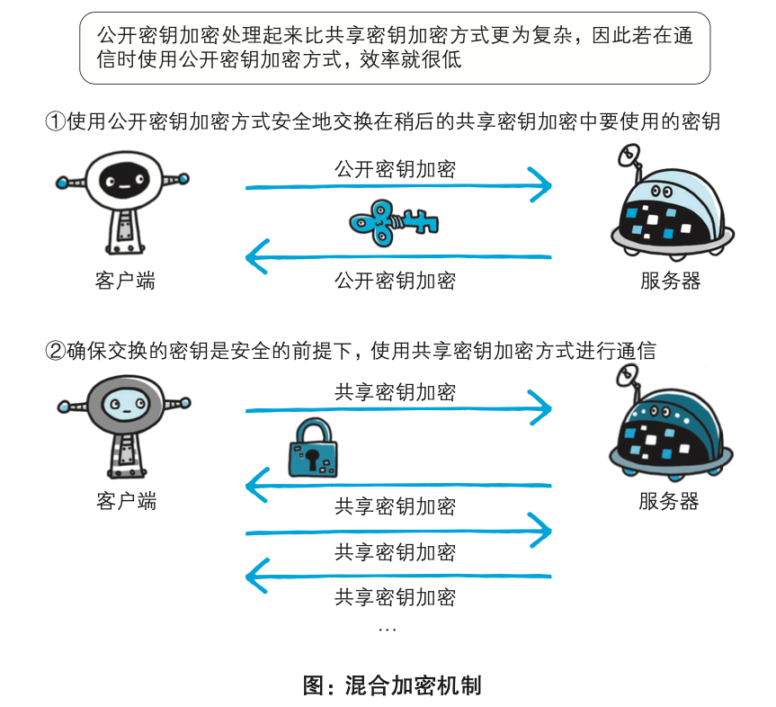
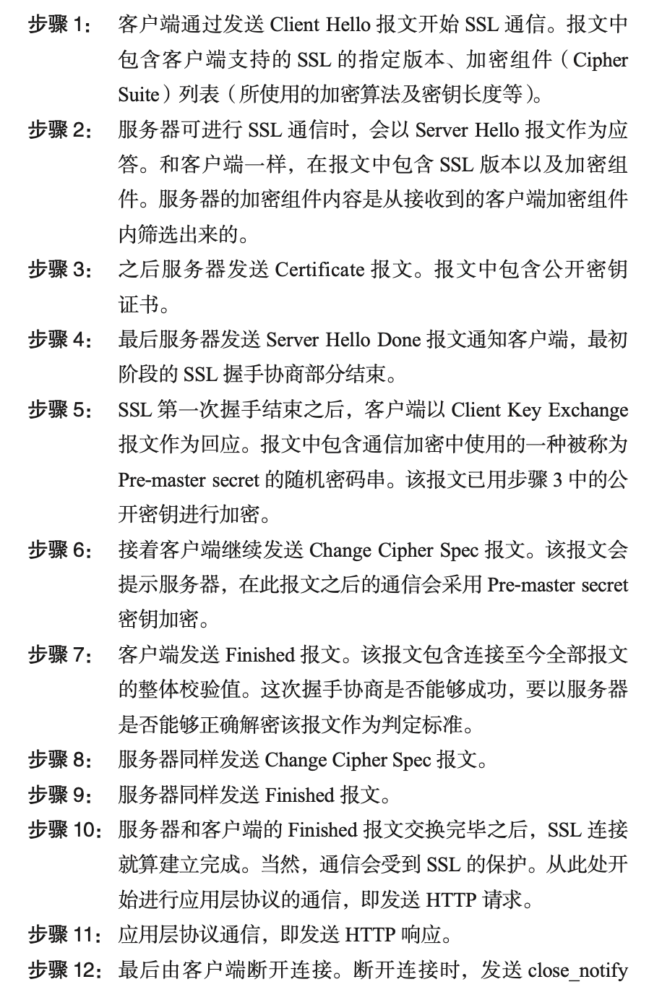
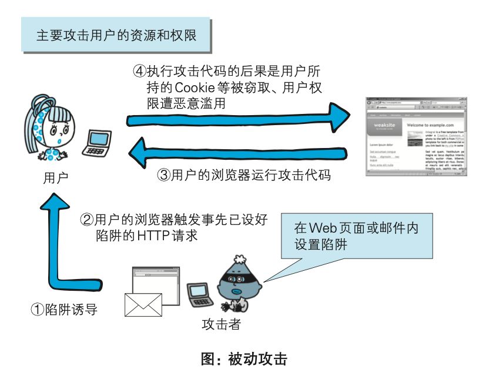

# Http协议

## 1. TCP/IP协议簇

TCP/IP分层管理：

* 应用层、传输层、网络层、数据链路层
* 层次化管理，分工明确可替换

### 1.1 应用层

决定了向用户提供应用服务时通信的活动，比如：FTP(File Transfer Protocol, 文件传输协议)、DNS(Domain Name System, 域名系统)、HTTP协议。

### 1.2 传输层

对上层应用层，提供处于网络连接中的两台计算机之间的数据传输，包含两个协议：TCP(Transmission Control Protocol, 传输控制协议)和UDP(User Data Protocol, 用户数据报协议)。
### 1.3 网络层（网络互连层）

处理在网络上流动的数据包（数据包是网络传输的最小数据单位），同时负责传输路线，在众多的选项中选择一条传输路线。

### 1.4 数据链路层（网络接口层）

处理连接网络的硬件部分，包括控制操作系统、硬件的设备驱动，NIC(Network Interface Card, 网络适配器，即网卡)，及光纤等物理可见部分（还包括链接器等一切传输媒介），硬件上的范畴均在链路层的作用范围之内。

### 1.3. TCP/IP 通信传输流

举例：

1. 发送端的客户端在应用层发出Http请求
2. 在传输层（TCP）协议把从应用层收到的数据（HTTP报文）进行分割，并在各个报文上打上标记序号及端口号后转发给网络层
3. 在网络层（IP协议），增加作为通信目的地的MAC地址后转发给链路层

发送端在层与层之间传输数据时，每经过一层会被打上一个该层所属的首部信息，反之，接收层在层与层传输数据时，每经过一层时会把对应的首部消去

### 1.4 IP、TCP、DNS

#### 负责传输的IP协议
IP(Internet protocol， 网际协议)属于网络层，负责把各种数据包传输给对方，依赖IP地址和MAC地址（Media Access Control Address）.

* IP地址指明了节点被分配到的地址（可变换）
* MAC地址是指网卡所属的固定地址（基本上不会更改）

IP地址可以和MAC地址进行配对。
ARP(Address Resolution Protocol)是一种用以解析地址的协议，根据通信方的IP地址就可以反查出对应的MAC地址。

为了把数据传输给对方，需要经过很多计算机和网络设备中转才能连接到对方，这个过程叫路由选择，类似于快递公司的送货过程。
**无论哪台计算机、哪台网络设备，都无法全面掌握互联网中的细节**

#### 确保可靠性的TCP协议
TCP位于传输层，提供可靠的字节流服务。

* 字节流服务：为了方便传输，讲大块数据分割成以报文段为单位的数据包进行管理

总之，TCP协议为了更容易传送大数据会把数据分割，而且能够确认数据最终是否送达到对方。
##### 确保数据到达目标

 **三次握手**

如果中途莫名中断，会再次以相同的顺序发送相同的数据包

#### 负责域名解析的DNS服务
DNS位于应用层，通过域名到IP地址之间的解析服务

#### 各种协议与HTTP协议的关系

### HTTP状态
* http协议是无状态的，每次http请求不会保存请求的内容
* 持久链接：keep-live:一旦建立TCP连接，除非有一端明确提出断开连接，否则保持TCP连接状态，即建立一次TCP连接后可以进行多次请求和响应的交互，但是，只能等上一个请求响应之后，才能发送下一个请求。
* 管道化（pipelining）方式：可以做到同时并行发送多个请求，而不需要一个接一个地等待响应。

#### 响应状态码

* 1XX  请求正在处理
* 2XX  请求响应成功
* 3XX  请求重定向
	* 301 Moved Permeanently 永久重定向
	* 302 Found 临时重定向，只是告诉你已经变了
	* 303 see other 临时重定向，但提示你按照新的方式访问
	* 304 Not Modified 允许请求，但是不符合条件
* 4XX  客户端请求错误
	* 400 Bad Request 请求语法错误
	* 401 Unauthorized 请求无权限
	* 403 Frobidden 拒绝响应
	* 404 Not Found  无法找到请求的资源
* 5XX  服务端响应错误
	* 500 Internet Server Error 服务端请求执行时发生了错误
	* 503 Seriver Unavailable	服务器暂时处于超负载或正在进行停机维护中，现在服务处理请求

### HTTP首部字段

 
* 报文首部：HTTP 协议的请求和响应报文中必定包含 HTTP 首部。首部内容为 客户端和服务器分别处理请求和响应提供所需要的信息。对于客户端用 户来说，这些信息中的大部分内容都无须亲自查看。使用首部字段是为了给浏览器和服务器提供报文主体大小、所使用 的语言、认证信息等内容。

 
 
 * 4种HTTP首部字段类型
   * 通用首部字段(General●Header●Fields)：请求报文和响应报文两方都会使用的首部。
   * 请求首部字段(Request●Header●Fields)：从客户端向服务器端发送请求报文时使用的首部。补充了请求的附 加内容、客户端信息、响应内容相关优先级等信息。
   * 响应首部字段(Response●Header●Fields)：从服务器端向客户端返回响应报文时使用的首部。补充了响应的附 加内容，也会要求客户端附加额外的内容信息。
   * 实体首部字段(Entity●Header●Fields)：针对请求报文和响应报文的实体部分使用的首部。补充了资源内容 更新时间等与实体有关的信息。

#### HTTP的基本优化

影响一个 HTTP 网络请求的因素主要有两个：带宽和延迟。

* 带宽：如果说我们还停留在拨号上网的阶段，带宽可能会成为一个比较严重影响请求的问题，但是现在网络基础建设已经使得带宽得到极大的提升，我们不再会担心由带宽而影响网速，那么就只剩下延迟了。

* 延迟：

  * 浏览器阻塞（HOL blocking）：浏览器会因为一些原因阻塞请求。浏览器对于同一个域名，同时只能有 4 个连接（这个根据浏览器内核不同可能会有所差异），超过浏览器最大连接数限制，后续请求就会被阻塞。

  * DNS 查询（DNS Lookup）：浏览器需要知道目标服务器的 IP 才能建立连接。将域名解析为 IP 的这个系统就是 DNS。这个通常可以利用DNS缓存结果来达到减少这个时间的目的。

  * 建立连接（Initial connection）：HTTP 是基于 TCP 协议的，浏览器最快也要在第三次握手时才能捎带 HTTP 请求报文，达到真正的建立连接，但是这些连接无法复用会导致每次请求都经历三次握手和慢启动。三次握手在高延迟的场景下影响较明显，慢启动则对文件类大请求影响较大。

### HTTPS

HTTP+ 加密 + 认证 + 完整性保护 =HTTPS

HTTPS 是身披 SSL 外壳的 HTTP

* 对称密钥加密: 加密和解密同用一个密钥的方式称为共享密钥加密
* 非对称密钥加密：公开密钥加密，私有密钥解密
* HTTPS采用混合加密机制: HTTPS 采用共享密钥加密和公开密钥加密两者并用的混合加密机 制。若密钥能够实现安全交换，那么有可能会考虑仅使用公开密钥加密 来通信。但是公开密钥加密与共享密钥加密相比，其处理速度要慢。
所以应充分利用两者各自的优势，将多种方法组合起来用于通信。 在交换密钥环节使用公开密钥加密方式，之后的建立通信交换报文阶段 则使用共享密钥加密方式。

* HTTPS 的安全通信机制

* HTTPS 使 用 SSL(Secure Socket Layer) 和 TLS(Transport Layer Security)这两个协议。

### WebSocket协议

WebSocket，即 Web 浏览器与 Web 服务器之间全双工通信标准，由于是建立在 HTTP 基础上的协议，因此连接的发起方仍是客户 端，而一旦确立 WebSocket 通信连接，不论服务器还是客户端，任意一 方都可直接向对方发送报文。
* 推送功能：服务端可以主动推送
* 减少通信量：只要建立起 WebSocket 连接，就希望一直保持连接状态。和 HTTP 相比，不但每次连接时的总开销减少，而且由于 WebSocket 的首部 信息很小，通信量也相应减少了。
* 握手-请求：为了实现 WebSocket 通信，需要用到 HTTP 的 Upgrade 首部字段， 告知服务器通信协议发生改变，以达到握手的目的。
* 握手-响应：成功握手确立 WebSocket 连接之后，通信时不再使用 HTTP 的数据 帧，而采用 WebSocket 独立的数据帧。
  

### SYDPY与HTTP2.0

#### SYDP

* 多路复用流：通过单一的 TCP 连接，可以无限制处理多个 HTTP 请求。所有 请求的处理都在一条 TCP 连接上完成，因此 TCP 的处理效率得到 提高。降低了延迟同时提高了带宽的利用率。
* 请求优先级：SPDY 不仅可以无限制地并发处理请求，还可以给请求逐个分配优先级顺序。这样主要是为了在发送多个请求时，解决因带宽低而导 致响应变慢的问题。
* 压缩 HTTP 首部：压缩 HTTP 请求和响应的首部。这样一来，通信产生的数据包数量 和发送的字节数就更少了。
* 推送功能：支持服务器主动向客户端推送数据的功能。这样，服务器可直接发 送数据，而不必等待客户端的请求。服务器可以主动提示客户端请求所需的资源。由于在客户端发现资 源之前就可以获知资源的存在，因此在资源已缓存等情况下，可以 避免发送不必要的请求。
* 基于 HTTPS 的加密协议传输，大大提高了传输数据的可靠性。

##### HTTP2.0 与 SPDY 不同点

[https://mp.weixin.qq.com/s/GICbiyJpINrHZ41u_4zT-A?]

HTTP2.0 可以说是 SPDY 的升级版（其实原本也是基于 SPDY 设计的），但是，HTTP2.0  跟 SPDY 仍有不同的地方，主要是以下两点：

* HTTP2.0  支持明文 HTTP 传输，而 SPDY 强制使用 HTTPS
* HTTP2.0 消息头的压缩算法采用 HPACK，而非 SPDY 采用的 DEFLATE

### HTTP2.0 的新特性

* 新的二进制格式（Binary Format），HTTP1.x 的解析是基于文本。基于文本协议的格式解析存在天然缺陷，文本的表现形式有多样性，要做到健壮性考虑的场景必然很多，二进制则不同，只认 0 和 1 的组合。基于这种考虑 HTTP2.0 的协议解析决定采用二进制格式，实现方便且健壮。
* 多路复用（MultiPlexing），即连接共享，即每一个 request 都是是用作连接共享机制的。一个 request 对应一个 id，这样一个连接上可以有多个 request，每个连接的 request 可以随机的混杂在一起，接收方可以根据 request 的 id 将 request 再归属到各自不同的服务端请求里面。
* header 压缩，如上文中所言，对前面提到过 HTTP1.x 的 header 带有大量信息，而且每次都要重复发送，HTTP2.0 使用 encoder 来减少需要传输的 header 大小，通讯双方各自 cache 一份 header fields 表，既避免了重复 header 的传输，又减小了需要传输的大小。HTTP2.0可以维护一个字典，差量更新HTTP头部，大大降低因头部传输产生的流量
* 服务端推送（server push），同 SPDY 一样，HTTP2.0 也具有 server push 功能。目前，有大多数网站已经启用 HTTP2.0，例如 YouTuBe，淘宝网等网站，利用 chrome 控制台可以查看是否启用 H2：

### Web攻击

HTTP不具备必要的安全功能，只是一个单纯的协议机制
在客户端即可篡改请求

攻击模式：
1. 主动攻击：主动攻击(active attack)是指攻击者通过直接访问 Web 应用，把 攻击代码传入的攻击模式。由于该模式是直接针对服务器上的资源进行 攻击，因此攻击者需要能够访问到那些资源。
   * SQL注入攻击：SQL 注入(SQL Injection)是指针对 Web 应用使用的数据库，通过 运行非法的 SQL 而产生的攻击。该安全隐患有可能引发极大的威胁， 有时会直接导致个人信息及机密信息的泄露。
   	   * SQL 注入攻击有可能会造成以下等影响。
          * 非法查看或篡改数据库内的数据
          * 规避认证
          * 执行和数据库服务器业务关联的程序等
   * OS命令注入攻击：OS 命令注入攻击(OS Command Injection)是指通过 Web 应用， 执行非法的操作系统命令达到攻击的目的。只要在能调用 Shell 函数的 地方就有存在被攻击的风险。
2. 被动攻击：被动攻击(passive attack)是指利用圈套策略执行攻击代码的攻击模 式。在被动攻击过程中，攻击者不直接对目标 Web 应用访问发起攻击。
   * 跨站脚本攻击（Cross-Site Scripting，XSS）：指通过存在安全漏洞 的 Web 网站注册用户的浏览器内运行非法的 HTML 标签或 JavaScript 进行的一种攻击。动态创建的 HTML 部分有可能隐藏着安全漏洞。就 这样，攻击者编写脚本设下陷阱，用户在自己的浏览器上运行时，一不 小心就会受到被动攻击。
       * 跨站脚本攻击有可能造成以下影响。
		1. 利用虚假输入表单骗取用户个人信息。
		2. 利用脚本窃取用户的 Cookie 值，被害者在不知情的情况下，帮助攻击者发送恶意请求。
		3. 显示伪造的文章或图片。

   * 跨站请求伪造：跨站点请求伪造(Cross-Site Request Forgeries，CSRF)攻击是指攻 击者通过设置好的陷阱，强制对已完成认证的用户进行非预期的个人信 息或设定信息等某些状态更新，属于被动攻击。
      * 攻击一般发起在第三方网站，而不是被攻击的网站。被攻击的网站无法防止攻击发生。
      * 攻击利用受害者在被攻击网站的登录凭证，冒充受害者提交操作；而不是直接窃取数据。
      * 整个过程攻击者并不能获取到受害者的登录凭证，仅仅是“冒用”。
      * 跨站请求可以用各种方式：图片URL、超链接、CORS、Form提交等等。部分请求方式可以直接嵌入在第三方论坛、文章中，难以进行追踪。
     * 跨站点请求伪造有可能会造成以下等影响。
        * 利用已通过认证的用户权限更新设定信息等
        * 利用已通过认证的用户权限购买商品
        * 利用已通过认证的用户权限在留言板上发表言论

      * 措施
        * 上文中讲了CSRF的两个特点：
          * CSRF（通常）发生在第三方域名。
          * CSRF攻击者不能获取到Cookie等信息，只是使用。
          * 针对这两点，我们可以专门制定防护策略，如下：

        * 阻止不明外域的访问
            * 同源检测
            * Samesite Cookie
        * 提交时要求附加本域才能获取的信息
            * CSRF Token
            * 双重Cookie验证
  

#### 因输出值转义不完全引发的安全漏洞

实施 Web 应用的安全对策可大致分为以下两部分。
* 客户端的验证
* Web 应用端(服务器端)的验证
    * 输入值验证
    * 输出值转义

